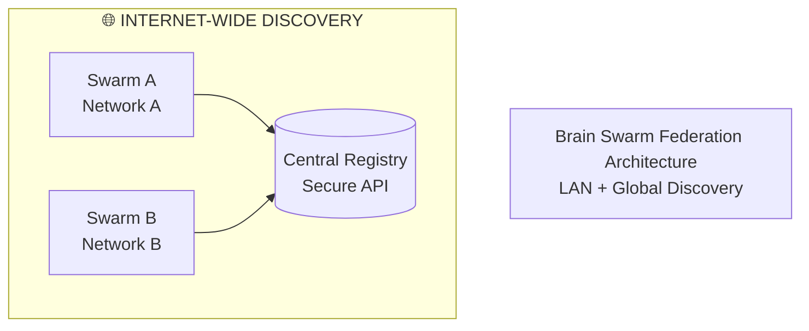

# Mermaid Architecture Diagrams

This directory contains clean, professional Mermaid diagrams for the Brain Swarm Federation architecture that can be embedded in documentation, presentations, and slides.

## 📊 Available Diagrams

### 1. **Simple Architecture Diagram** (`architecture_diagram_simple.mmd`)
- **Purpose**: High-level overview for presentations and executive summaries
- **Content**: Three main discovery scenarios with security highlights
- **Best for**: Slides, executive briefings, stakeholder presentations

### 2. **Comprehensive Architecture Diagram** (`architecture_diagram.mmd`)
- **Purpose**: Detailed technical architecture for developers and architects
- **Content**: Complete component breakdown, data flows, performance metrics, deployment scenarios
- **Best for**: Technical documentation, developer onboarding, detailed design reviews

## 🎨 Rendering Options

### Online Mermaid Editors
1. **Mermaid Live Editor**: https://mermaid.live/
   - Paste diagram code directly
   - Real-time rendering
   - Export to PNG/SVG

2. **GitHub/GitLab**: Automatic rendering in Markdown files
   - Use ````mermaid` code blocks
   - Renders directly in repository views

### Desktop Tools
1. **VS Code + Mermaid Extension**
   - Install "Mermaid Preview" extension
   - Live preview while editing

2. **Draw.io (diagrams.net)**
   - Import Mermaid diagrams
   - Export to various formats

### Command Line
```bash
# Using mmdc (Mermaid CLI)
npm install -g @mermaid-js/mermaid-cli
mmdc -i architecture_diagram_simple.mmd -o architecture.png

# Using Puppeteer
npm install -g mermaid-cli
mermaid -i architecture_diagram_simple.mmd -o architecture.png
```

## 📋 Usage Examples

### In Markdown Documentation
```markdown
## System Architecture


```

### In Presentation Slides

#### Slide 1: High-Level Overview
```
┌─────────────────────────────────────┐
│  Brain Swarm Federation             │
│  Architecture Overview              │
│                                     │
│  [Embed: architecture_diagram_simple.mmd]
│                                     │
└─────────────────────────────────────┘
```

#### Slide 2: Technical Deep Dive
```
┌─────────────────────────────────────┐
│  Detailed Architecture              │
│  Components & Data Flow             │
│                                     │
│  [Embed: architecture_diagram.mmd]
│  (Focus on relevant sections)       │
│                                     │
└─────────────────────────────────────┘
```

### In Confluence/Jira
1. Install Mermaid macro/plugin
2. Paste diagram code in macro
3. Diagrams render automatically

## 🎯 Diagram Sections

### Simple Diagram Components
- **🌐 Internet-Wide Discovery**: Global registry-based discovery
- **🏠 LAN-Only Discovery**: Local UDP broadcast discovery
- **🔄 Hybrid Discovery**: Combined LAN + internet approach
- **🔐 Security Layers**: Authentication and encryption highlights

### Comprehensive Diagram Sections
- **Main Architecture**: Three discovery scenarios with detailed components
- **Security Architecture**: Complete security layer breakdown
- **Data Flow**: Discovery and communication flow diagrams
- **Performance**: Method comparison and characteristics
- **Deployment**: Different deployment scenario options

## 🔧 Customization

### Color Schemes
```mermaid
%% Custom colors for different audiences
classDef internetClass fill:#e1f5fe,stroke:#01579b,stroke-width:2px
classDef lanClass fill:#f3e5f5,stroke:#4a148c,stroke-width:2px
classDef securityClass fill:#ffebee,stroke:#b71c1c,stroke-width:2px
```

### Focus Areas
```mermaid
%% Highlight specific components for presentations
classDef highlightClass fill:#fff9c4,stroke:#f57f17,stroke-width:3px
class REGISTRY highlightClass

graph TD
    A[Brain Swarm] --> B[Registry]
    B --> C[Discovery]
```

### Simplified Versions
Create focused diagrams for specific audiences:
- **Executive**: High-level overview only
- **Technical**: Detailed component interactions
- **Security**: Focus on security architecture
- **Operations**: Deployment and monitoring aspects

## 📈 Best Practices

### For Presentations
1. **Start Simple**: Use simple diagram for initial overview
2. **Progressive Disclosure**: Reveal complexity gradually
3. **Color Coding**: Use consistent colors for component types
4. **Annotations**: Add callouts for key points
5. **Sizing**: Ensure diagrams fit slide dimensions

### For Documentation
1. **Version Control**: Keep diagrams with code
2. **Cross-References**: Link to detailed implementation docs
3. **Accessibility**: Ensure color choices are accessible
4. **Updates**: Keep diagrams synchronized with code changes

### For Technical Reviews
1. **Component Details**: Show implementation details
2. **Data Flow**: Highlight communication patterns
3. **Failure Modes**: Include error handling and recovery
4. **Performance**: Show scalability and performance characteristics

## 🔄 Maintenance

### Updating Diagrams
1. **Code Changes**: Update diagrams when architecture changes
2. **Version Control**: Track diagram versions with releases
3. **Review Process**: Include diagram reviews in architecture reviews
4. **Automation**: Consider automated diagram generation from code

### Version History
- **v1.0**: Initial LAN + Global discovery architecture
- **v1.1**: Added security layer details
- **v1.2**: Enhanced deployment scenarios
- **v1.3**: Performance characteristics and failure modes

## 🎨 Rendering Examples

### PNG Export (High Quality)
```bash
# Generate high-quality PNG
mmdc -i architecture_diagram_simple.mmd \
     -o architecture_diagram.png \
     -t dark \
     -b transparent \
     -w 1920 \
     -h 1080
```

### SVG Export (Scalable)
```bash
# Generate scalable SVG
mmdc -i architecture_diagram_simple.mmd \
     -o architecture_diagram.svg \
     -t default
```

### Different Themes
- `default`: Clean, professional appearance
- `dark`: Dark theme for presentations
- `forest`: Green color scheme
- `neutral`: Minimal color usage

## 📚 Related Documentation

- **[Global Discovery README](GLOBAL_DISCOVERY_README.md)**: Complete technical implementation guide
- **[Federation Integration README](FEDERATION_INTEGRATION_README.md)**: Integration and usage guide
- **[ASCII Diagram](DISCOVERY_ARCHITECTURE_DIAGRAM.md)**: Detailed text-based architecture diagram
- **[System Summary](FEDERATION_SYSTEM_SUMMARY.md)**: Complete system overview

## 🤝 Contributing

When updating architecture diagrams:
1. Test rendering in multiple formats (PNG, SVG, web)
2. Ensure accessibility (color contrast, alt text)
3. Update version history
4. Review with architecture team
5. Update related documentation

---

**Format**: Mermaid diagrams for clean, embeddable visualizations
**Purpose**: Make complex architecture instantly digestible for all audiences
**Maintenance**: Keep synchronized with code and documentation changes
