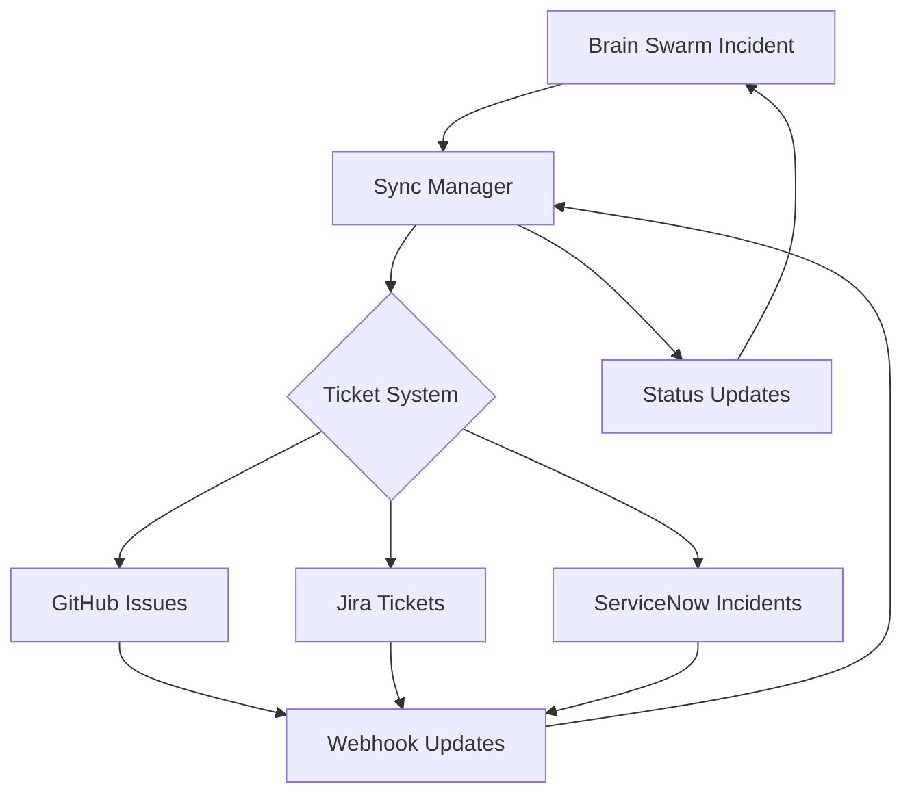
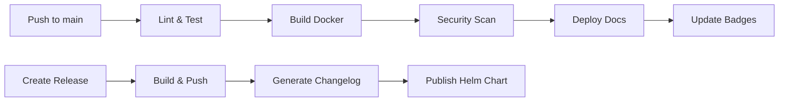

# 🧠 Brain Swarm
[](https://github.com/jfbinTECHA/brain-swarm/releases)
[](https://github.com/jfbinTECHA/brain-swarm/pkgs/container/brain-swarm)
[](https://hub.docker.com/r/jfbintecha/brain-swarm)
[](LICENSE)
[](https://github.com/jfbinTECHA/brain-swarm/actions)
[](https://jfbintecha.github.io/brain-swarm/)

Note: Project on hold on fixed income prior service ptsd : once hardware is achieved will continue on roadmap to cognition
---
<p align="center">
  
</p>

## 🚀 Features

- **Agent Swarm Control Hub** – orchestrates multi-agent collaboration and messaging
- **Transformer-ready Core** – supports integration with LLMs via OpenAI / OpenRouter APIs
- **Realtime WebSocket Prototype** – bidirectional communication layer for dashboards
- **Kubernetes-Native Design** – scalable across cloud nodes
- **Plug-and-Play Modules** – attach agents, data streams, or external APIs easily
- **Enterprise Security** – Rate limiting, IP whitelisting, TLS encryption with NGINX/Traefik ingress
- **Enterprise Observability** – comprehensive monitoring, tracing, and alerting with Prometheus metrics
- **Custom Grafana Dashboards** – branded login pages, architecture diagrams, and real-time monitoring
- **Bi-Directional Ticket Sync** – Real-time synchronization between incidents and external ticket systems
- **Knowledge Cortex** – 4-layer hierarchical memory system (Cache → Vector → Graph → Archive)
- **Multi-Provider Embeddings** – OpenAI, OpenRouter, and local sentence transformers
- **Developer Portal** – interactive API documentation with MkDocs Material

---

## 📅 Release Timeline

### v1.0.0 - Brain Swarm Ops (Current)
**Released: October 2023**

- ✅ Enterprise Incident Response Platform
- ✅ Multi-cluster federation with Redis
- ✅ AI-driven triage and orchestration
- ✅ Comprehensive observability stack
- ✅ MkDocs documentation portal
- ✅ Helm chart deployment
- ✅ GitHub Actions CI/CD

### v0.5.0 - Federation Core
**Released: September 2023**

- ✅ LAN + Global discovery architecture
- ✅ WebSocket federation manager
- ✅ UDP broadcast for local networks
- ✅ Registry-based global discovery
- ✅ Hybrid discovery modes

### v0.3.0 - Swarm Intelligence
**Released: August 2023**

- ✅ Multi-agent coordination system
- ✅ Plugin-based agent registry
- ✅ Message queue architecture
- ✅ Basic scalability features
- ✅ REST API endpoints

### v0.1.0 - Foundation
**Released: July 2023**

- ✅ Core agent framework
- ✅ WebSocket communication prototype
- ✅ Basic task delegation
- ✅ Docker containerization
- ✅ Initial documentation

### Roadmap v1.1.0 (Q4 2023)
- 🔄 Enhanced AI orchestration with Kilo Code integration
- 🔄 Advanced auto-scaling algorithms
- 🔄 Multi-cloud federation support
- 🔄 Enhanced security features
- 🔄 Performance optimizations

## 📊 Custom Grafana Dashboards

Brain Swarm provides fully branded Grafana dashboards with custom theming and architecture assets:

### Dashboard Features

- **Branded Login Page**: Custom Brain Swarm themed login with animated elements
- **Architecture Diagrams**: Interactive system architecture visualizations
- **Real-time Metrics**: Live Prometheus metrics with custom panels
- **Incident Response Dashboards**: Specialized views for operations teams
- **Federation Monitoring**: Cross-swarm communication and health metrics

### Custom Assets

The dashboards include custom branding assets:

- Brain Swarm logo and favicon
- Custom login background and styling
- Architecture diagrams as dashboard panels
- Branded footer and navigation elements

### Dashboard Access

```bash
# Access Grafana (when deployed with Helm)
kubectl port-forward svc/brain-swarm-grafana 3000:80 -n brainswarm

# Open in browser
open http://localhost:3000

# Default credentials
# Username: admin
# Password: admin (change in production!)
```

### Available Dashboards

1. **Brain Swarm Overview** - System health, agent status, task metrics
2. **Incident Response** - Real-time incident monitoring and triage
3. **Federation Status** - Cross-swarm communication and health
4. **Performance Metrics** - Detailed performance and latency charts

📁 **Grafana Assets**: [`helm/brain-swarm/templates/grafana-assets.yaml`](helm/brain-swarm/templates/grafana-assets.yaml)
📁 **Dashboard JSON**: [`dashboards/`](dashboards/)

## 🔄 Bi-Directional Ticket Synchronization

Brain Swarm provides comprehensive bi-directional synchronization between incidents and external ticket systems, ensuring real-time updates in both directions.

### Supported Systems

- **GitHub Issues** - Real-time webhook integration with issue lifecycle management
- **Jira** - Full ticket lifecycle with priority mapping and status synchronization
- **ServiceNow** - Enterprise incident management with assignment groups

### Synchronization Features

- **Real-time Webhooks** - Instant updates when tickets are modified externally
- **Periodic Polling** - Catches missed updates with configurable intervals
- **Conflict Resolution** - Configurable strategies for handling conflicting updates
- **Retry Mechanisms** - Automatic retry with exponential backoff for failed operations
- **Status Mapping** - Intelligent mapping between incident and ticket statuses
- **Comprehensive Logging** - Full audit trail of all synchronization operations

### Architecture



### Configuration

```yaml
swarmops:
  bidirectionalSync:
    enabled: true
    github:
      enabled: true
      owner: "myorg"
      repo: "incidents"
    jira:
      enabled: true
      url: "https://mycompany.atlassian.net"
      projectKey: "ALERT"
    servicenow:
      enabled: true
      instanceUrl: "https://mycompany.servicenow.com"
      assignmentGroup: "IT Operations"
```

### Sync Status Monitoring

```bash
# Check sync status
curl http://localhost:8000/sync/status

# View sync metrics
curl http://localhost:8000/metrics | grep sync
```

📁 **Sync Service**: [`swarmops_bidirectional_sync.py`](swarmops_bidirectional_sync.py)
📁 **Helm Templates**: [`helm/brain-swarm/templates/swarmops-bidirectional-sync-*`](helm/brain-swarm/templates/)

## 🔒 Enterprise Security & Ingress

Brain Swarm provides enterprise-grade security with comprehensive ingress management:

### NGINX Ingress Controller

```yaml
# Enable with security features
ingress:
  enabled: true
  host: "api.brain-swarm.company.com"
  security:
    rateLimit:
      average: 10  # RPS
      burst: 20
    ipWhitelist:
      - "10.0.0.0/8"      # Internal networks
      - "172.16.0.0/12"   # Private networks
```

### Traefik Ingress (Alternative)

```yaml
ingress:
  enabled: true
  traefikEnabled: true
  host: "api.brain-swarm.company.com"
  security:
    rateLimit:
      average: 10
      burst: 20
    ipWhitelist:
      - "10.0.0.0/8"
```

### Security Features

- **Rate Limiting**: Configurable RPS limits with burst capacity
- **IP Whitelisting**: Restrict access to specific CIDR ranges
- **TLS Encryption**: Automatic certificate management with cert-manager
- **Security Headers**: XSS protection, content type sniffing prevention
- **Request Filtering**: Block malicious patterns and attack vectors

### Deployment with Security

```bash
# Deploy with enterprise security
helm install brain-swarm ./helm/brain-swarm \
  --set ingress.enabled=true \
  --set ingress.host=api.company.com \
  --set ingress.security.ipWhitelist='["10.0.0.0/8"]' \
  --set ingress.tls.enabled=true
```

📁 **Helm Chart**: [`helm/brain-swarm/`](helm/brain-swarm/)
📖 **Security Guide**: [`helm/brain-swarm/README.md`](helm/brain-swarm/README.md)

## 📊 Observability & Metrics

Brain Swarm provides comprehensive observability with Prometheus instrumentation:

### Metrics Endpoints

- **`/metrics`** - JSON metrics for dashboards and monitoring
- **`/metrics/prometheus`** - Raw Prometheus format for scraping
- **`/metrics/dashboard`** - Formatted metrics for UI consumption

### Key Metrics

| Metric Type | Examples | Purpose |
|-------------|----------|---------|
| **Counters** | `brain_swarm_tasks_created_total` | Cumulative counts |
| **Gauges** | `brain_swarm_agent_load` | Current values |
| **Histograms** | `brain_swarm_task_duration_seconds` | Distributions |

### Sample Metrics

```prometheus
# Task metrics
brain_swarm_tasks_created_total{task_type="analysis", priority="2"} 15
brain_swarm_tasks_completed_total{status="success"} 12
brain_swarm_task_duration_seconds_bucket{le="10.0"} 8

# Agent metrics
brain_swarm_agents_total{swarm_id="main"} 5
brain_swarm_agent_load{agent_id="agent_001"} 0.75

# API metrics
brain_swarm_api_requests_total{endpoint="/tasks", method="POST"} 23
brain_swarm_api_request_duration_seconds{endpoint="/health"} 0.001
```

### Metrics Demo

📁 **Metrics Demo**: [`examples/metrics_demo.py`](examples/metrics_demo.py)

Run the demo to see comprehensive metrics collection in action:

```bash
python examples/metrics_demo.py
```

This demonstrates:
- Real-time metrics recording
- Multiple output formats
- API endpoint testing
- Performance monitoring

## 🧠 Knowledge Cortex Memory System

Brain Swarm features a sophisticated 4-layer hierarchical memory architecture:

### Memory Layers

| Layer | Technology | Purpose | Latency |
|-------|------------|---------|---------|
| **Cache** | Redis | Fast temporary storage | < 1ms |
| **Vector** | ChromaDB + FAISS | Semantic search & similarity | 10-100ms |
| **Graph** | NetworkX + DuckDB | Relational knowledge & traversal | 1-50ms |
| **Archive** | S3 + DuckDB | Long-term persistent storage | 100-1000ms |

### Key Features

- **Hierarchical Lookup**: Cache → Vector → Graph → Archive
- **Automatic Data Distribution**: Smart routing based on content type
- **Semantic Search**: AI-powered similarity matching
- **Relationship Mapping**: Graph-based knowledge representation
- **Cloud Archive**: Scalable long-term storage with S3

### Embedding Integration

The Knowledge Cortex integrates multiple embedding providers for semantic search:

```python
from cortex.adapters.embedding_adapter import embedding_adapter

# Automatic provider selection (OpenAI → OpenRouter → Local → Fallback)
embeddings = embedding_adapter.embed_texts([
    "Machine learning algorithms",
    "Neural network architectures",
    "Deep learning optimization"
])

# Embeddings automatically used by vector layer
knowledge_cortex.store("ml_concepts", ml_content, {"vectorize": True})
```

📁 **Embedding Demo**: [`examples/embedding_demo.py`](examples/embedding_demo.py)

### Usage Example

```python
from memory.knowledge_cortex import knowledge_cortex

# Store user profile with semantic search
knowledge_cortex.store("user_123", user_data, {"vectorize": True})

# Add organizational relationships
knowledge_cortex.add_relationship("user_123", "team_alpha", "member_of")

# Semantic search across knowledge base
results = knowledge_cortex.search("experienced developers")

# Retrieve with automatic layer lookup
user = knowledge_cortex.retrieve("user_123")
```

📁 **Memory System**: [`memory/`](memory/)
📖 **Documentation**: [`memory/README.md`](memory/README.md)

---

## 🧩 Architecture

---

## 🧰 Tech Stack

| Component | Technology |
|------------|-------------|
| Core Agents | Python 3.12+ |
| Communication | WebSockets / FastAPI |
| Dashboard | Next.js / Vercel |
| Deployment | Docker & Kubernetes |
| Version Control | Git + GitHub |

---

## 🚀 Scalability & Multi-Cluster Federation

Brain Swarm supports **horizontal scaling** with Redis-backed message buses and multi-cluster federation for enterprise-grade deployments.

### Quick Scalable Deployment

```bash
# Deploy scalable multi-cluster setup
docker-compose -f docker-compose.scalable.yml up -d

# Access points:
# - Primary API: http://localhost:8000 (Load balanced across clusters)
# - Monitoring: http://localhost:9090 (Prometheus)
# - Dashboards: http://localhost:3000 (Grafana)
# - Traefik Dashboard: http://localhost:8080
```

### Architecture Features

- **Redis Cluster**: 3-node Redis cluster for persistent, scalable messaging
- **Multi-Cluster Federation**: Intelligent task distribution across specialized clusters
- **Async Agent Pools**: Auto-scaling agent pools with load balancing
- **Horizontal Scaling**: Add clusters dynamically based on workload
- **Load Balancing**: Multiple strategies (least-loaded, weighted, geographic)
- **Monitoring**: Comprehensive observability across all clusters

### Cluster Types

- **Primary Cluster**: API gateway, coordination, and general task processing
- **Compute Clusters**: Specialized math/computation workloads
- **AI Clusters**: ML inference and GPU-accelerated processing
- **Edge Clusters**: Low-latency, real-time processing

### Scaling Commands

```bash
# Scale up compute cluster
docker-compose -f docker-compose.scalable.yml up -d --scale brain-swarm-compute-1=3

# Add new AI cluster
docker-compose -f docker-compose.scalable.yml up -d brain-swarm-ai-2

# Check cluster health
curl http://localhost:8000/health
```

---

## 📚 Documentation

Brain Swarm features a comprehensive developer portal with interactive API documentation:

### Local Development

```bash
# Install documentation dependencies
pip install mkdocs mkdocs-material mkdocstrings mkdocs-openapi-plugin

# Generate API documentation
python generate_docs.py

# Serve documentation locally
mkdocs serve

# Access at http://localhost:8000
```

### Features

- **Interactive API Explorer**: Try API endpoints directly from the browser
- **Auto-generated OpenAPI Spec**: Always up-to-date API documentation
- **Monitoring & Observability Guide**: Complete observability documentation
- **Code Examples**: Python, JavaScript, and curl examples
- **Architecture Diagrams**: Visual system architecture documentation
- **Run a Simulation**: Complete guide with curl commands and live metrics

### CI/CD Integration

Comprehensive CI/CD pipeline with automated testing, security scanning, and deployment:

- **Automated Testing**: Pytest with coverage reporting and Codecov integration
- **Code Quality**: Flake8 linting, Black formatting, isort import sorting
- **Security Scanning**: Trivy vulnerability scanning with SARIF reports
- **Container Builds**: Multi-platform Docker builds with GitHub Container Registry
- **Documentation**: MkDocs with Material theme, deployed to GitHub Pages
- **Release Automation**: Automated releases with changelog generation and Helm chart publishing

#### GitHub Actions Workflows

- **`ci.yml`**: Comprehensive CI with linting, testing, building, and security scanning
- **`docs.yml`**: Documentation testing and deployment with link checking
- **`release.yml`**: Automated releases with Docker images and Helm charts
- **`update-badges.yml`**: Auto-update version badges from Helm chart changes

#### Deployment Pipeline



#### Quality Gates

- ✅ Code coverage > 80%
- ✅ No critical security vulnerabilities
- ✅ All tests passing
- ✅ Documentation builds successfully
- ✅ Linting and formatting checks pass

---

## 🚀 Quick Start

### Kubernetes Deployment (Recommended)

```bash
# Add Helm repository
helm repo add brain-swarm https://jfbintecha.github.io/brain-swarm
helm repo update

# Install with Helm
helm install brain-swarm brain-swarm/brain-swarm

# Or install from local chart
git clone git@github.com:jfbinTECHA/brain-swarm.git
cd brain-swarm
helm install brain-swarm ./helm/brain-swarm
```

### Docker Compose (Development)

```bash
# Start with Docker Compose
docker-compose up -d

# Access the API at http://localhost:8000
# View documentation at http://localhost:8000/docs
```

### Local Development

```bash
# Run locally
pip install -r requirements.txt
python -m api.main

# Access at http://localhost:8000
```

### Helm Chart Features

The Brain Swarm Helm chart provides:

- **Complete Kubernetes deployment** with all components
- **Production-ready configuration** with security best practices
- **Scalability settings** for high-availability deployments
- **Monitoring integration** with Prometheus and Grafana
- **Service mesh ready** with Istio/Traefik support

📁 **Chart Location**: [`helm/brain-swarm/`](helm/brain-swarm/)
📖 **Documentation**: [`helm/README.md`](helm/README.md)

---

## 🐳 Container Images

Pre-built images available on Docker Hub:

```bash
# Pull the latest image
docker pull jfbintecha/brain-swarm:latest

# Or use specific version
docker pull jfbintecha/brain-swarm:v1.0.0
```

---

## 🤝 Contributing

We welcome contributions! Please see our [Contributing Guide](CONTRIBUTING.md) for details.

## 📄 License

This project is licensed under the MIT License - see the [LICENSE](LICENSE) file for details.
