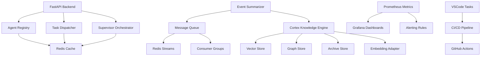
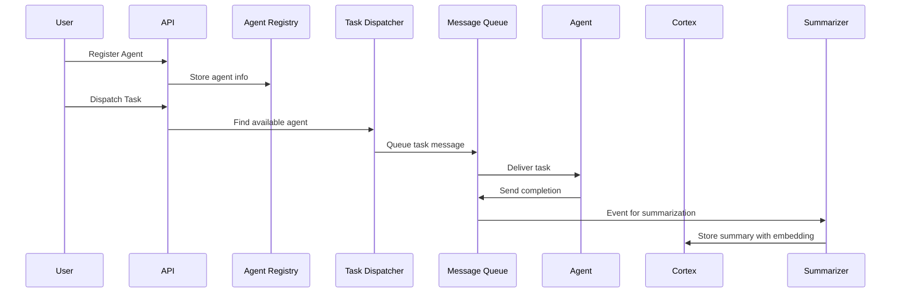
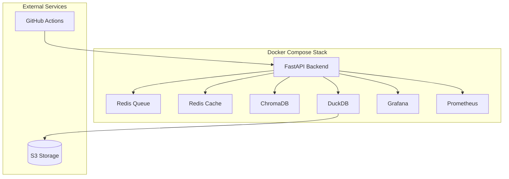

# Brain-Swarm Architecture

Brain-Swarm is a distributed agent orchestration platform that combines knowledge processing, real-time messaging, and observability into a cohesive system for building intelligent multi-agent applications.

## System Overview

## Core Components

### 1. FastAPI Backend (`backend/main.py`)

The central API server that exposes endpoints for:
- **Agent Management**: Registration, status monitoring, capability discovery
- **Task Dispatch**: Queue-based task distribution to available agents
- **Supervisor Orchestration**: Multi-agent workflow coordination
- **Metrics Exposure**: Prometheus-compatible `/metrics` endpoint

### 2. Agent Registry

In-memory registry of active agents with:
- Agent capabilities and metadata
- Health status and last heartbeat
- Task assignment tracking

### 3. Task Dispatcher (`/agent/dispatch`)

Implements a simple round-robin task distribution:
- Accepts task requests with agent type requirements
- Matches tasks to available agents
- Tracks task lifecycle (queued → dispatched → completed/failed)

### 4. Supervisor Orchestrator (`/supervisor/orchestrate`)

Coordinates complex multi-agent workflows:
- Accepts workflow definitions with task dependencies
- Dispatches tasks in sequence or parallel
- Aggregates results and handles failures

### 5. Cortex Knowledge Engine (`cortex/`)

Multi-layered knowledge processing system:

#### Vector Layer (`cortex/adapters/vector_chroma_faiss.py`)
- ChromaDB for vector storage
- FAISS for efficient similarity search
- Configurable embedding dimensions

#### Graph Layer (`cortex/adapters/graph_nx_duckdb.py`)
- NetworkX for in-memory graph operations
- DuckDB for persistent graph storage
- Temporal relationship modeling

#### Archive Layer (`cortex/adapters/archive_s3_duckdb.py`)
- S3-compatible object storage
- DuckDB for metadata indexing
- Long-term knowledge retention

#### Embedding Adapter (`cortex/adapters/embedding_adapter.py`)
- Pluggable embedding providers
- Fallback to SHA256 for development
- Batch processing capabilities

### 6. Message Queue (`message_queue.py`)

Redis Streams-based messaging system:
- Persistent message storage
- Consumer groups for load balancing
- Broadcast and point-to-point messaging
- Message replay capabilities

### 7. Event Summarizer (`cortex/summarizer_job.py`)

Automated event compaction and summarization:
- Collects events from Redis streams
- Groups by topic and time windows
- Generates embeddings for summaries
- Stores in Cortex for retrieval

### 8. Observability Stack

#### Prometheus Metrics (`prometheus_fastapi_instrumentator`)
- HTTP request metrics
- Custom business metrics
- Agent performance tracking
- System health indicators

#### Grafana Dashboards (`infra/dashboards/`)
- Agent activity monitoring
- System performance metrics
- Task completion rates
- Error tracking and alerting

### 9. CI/CD Pipeline (`.github/workflows/`)

Automated quality assurance:
- **CI** (`ci.yml`): Linting, testing, security scanning
- **Docs** (`docs.yml`): Automated documentation deployment
- **Release** (`release.yml`): Changelog generation and tagging

### 10. VSCode Tasks (`.vscode/tasks.json`)

Developer control panel with:
- Repository maintenance tasks
- Build and test automation
- Deployment workflows
- Monitoring and verification

## Data Flow

## Deployment Architecture

## Security Considerations

- **API Authentication**: JWT-based agent authentication
- **Message Encryption**: TLS for Redis connections
- **Access Control**: Capability-based agent permissions
- **Audit Logging**: Comprehensive event logging in Cortex
- **SBOM Generation**: Automated dependency vulnerability scanning

## Scalability Features

- **Horizontal Agent Scaling**: Add agents without system changes
- **Partitioned Message Queues**: Redis cluster support
- **Federated Deployments**: Multi-region swarm coordination
- **Async Processing**: Non-blocking task execution
- **Resource Pooling**: Shared knowledge stores across agents

## Development Workflow

See [Developer Guide](DEVELOPER_GUIDE.md) for detailed setup and usage instructions.

## Roadmap

See [Roadmap](ROADMAP.md) for upcoming features and milestones.

---

*This architecture supports both simple agent coordination and complex multi-agent workflows with full observability and automated maintenance.*
