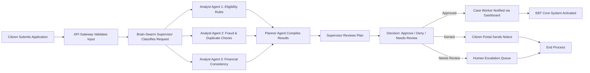
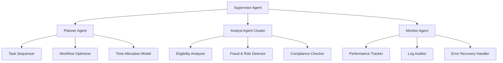
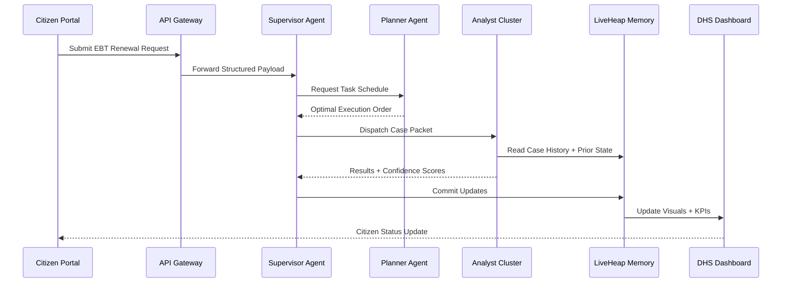
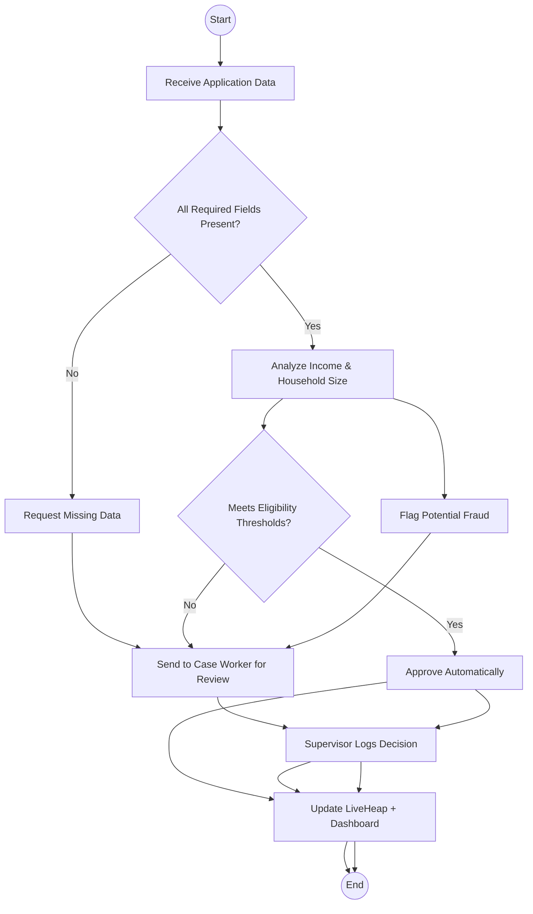

# 🧩 Maine DHS EBT LiveHeap System — Architecture & Integration with Brain-Swarm

## 📘 Overview
The **EBT LiveHeap** concept brings intelligent automation and swarm coordination to the Maine Department of Human Services’ Electronic Benefit Transfer (EBT) operations.
It integrates **AI-driven agents**, **real-time memory streams**, and **state-secured data infrastructure** to reduce manual work, accelerate eligibility decisions, and improve transparency.

## 🧠 System Architecture (High-Level)
```mermaid
graph TD
    subgraph DHS["Maine DHS Environment"]
        D1[Citizen Portal<br>(Mobile/Web Access)]
        D2[Case Worker Dashboard<br>(Eligibility & Benefits Management)]
        D3[EBT Core System<br>(Balances, Transactions, Card Mgmt)]
        D4[Document Intake / OCR System]
        D5[Reporting & Audit Tools]
    end

    subgraph BrainSwarm["Brain-Swarm AI Layer"]
        B1[Supervisor Agent<br>(Task Routing & Policy Logic)]
        B2[Analyst Agents<br>(Eligibility Analysis, Fraud Detection, Case Insights)]
        B3[Planner Agent<br>(Process Optimization, Load Balancing)]
        B4[Knowledge Core<br>(Rules, ML Models, Historical Data)]
        B5[LiveHeap Engine<br>(Real-time State & Memory Cache)]
    end

    subgraph CloudInfra["GovNet / State Cloud Infrastructure"]
        C1[Secure API Gateway]
        C2[Data Lake<br>(Citizen, Program, Financial Data)]
        C3[Monitoring & Dashboards]
        C4[Authentication & Identity Service]
    end

    %% Data Flow
    D1 -->|Applications, Updates| C1
    D2 -->|Case Notes, Approvals| C1
    D4 -->|Scanned Docs| C2
    D3 -->|Transactions| C2
    C1 --> B1
    B1 -->|Route Tasks| B2
    B2 -->|Insights, Scoring| B1
    B1 -->|Optimized Plan| B3
    B3 -->|Workflow Commands| D2
    B4 <--> B2
    B5 <--> B4
    B5 --> C3
    C2 -->|Data Streams| B5
    C3 -->|Program Metrics| DHS
    D1 -->|Citizen Notifications| D2
```

## 🔄 Process Flow (Detailed)


## 🤖 Agent Hierarchy & Roles


## ⏳ Sequence Diagram (EBT Renewal Process)


## 🔀 Decision Flowchart (Application Processing)


## 🚀 Implementation Roadmap
- Build a prototype of the Analyst Cluster.
- Implement the LiveHeap memory API.
- Connect a visualization dashboard.
- Conduct a 30-day sandbox evaluation.