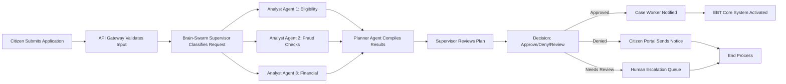
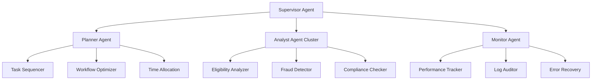
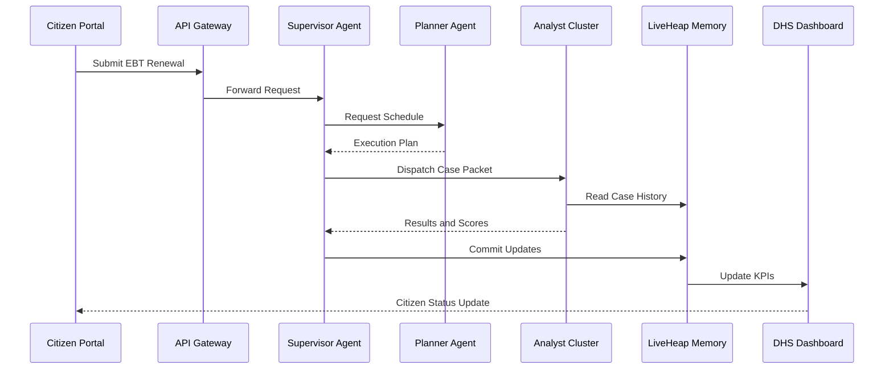
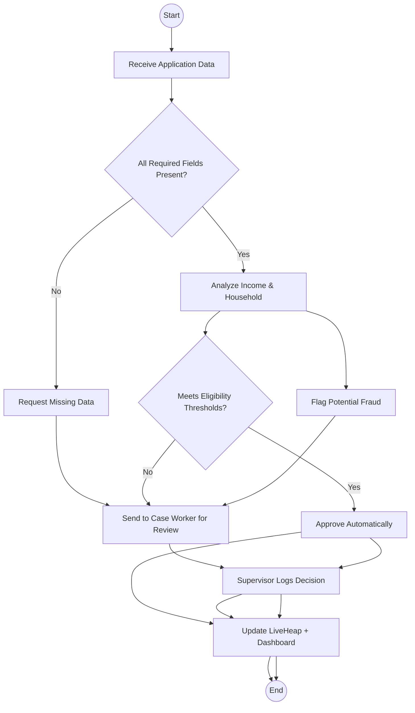

# Maine DHS EBT LiveHeap System — Architecture & Integration with Brain-Swarm

## Overview
The **EBT LiveHeap** concept brings intelligent automation and swarm coordination to the Maine Department of Human Services’ Electronic Benefit Transfer (EBT) operations.
It integrates **AI-driven agents**, **real-time memory streams**, and **state-secured data infrastructure** to reduce manual work, accelerate eligibility decisions, and improve transparency.

## System Architecture (High-Level)
```mermaid
graph TD
    subgraph DHS["Maine DHS Environment"]
        D1[Citizen Portal\n(Web/Mobile Access)]
        D2[Case Worker Dashboard\n(Eligibility & Benefits)]
        D3[EBT Core System\n(Balances, Transactions)]
        D4[Document Intake / OCR]
        D5[Reporting & Audit Tools]
    end

    subgraph BrainSwarm["Brain-Swarm AI Layer"]
        B1[Supervisor Agent\n(Task Routing & Policy)]
        B2[Analyst Agents\n(Eligibility, Fraud, Insights)]
        B3[Planner Agent\n(Process Optimization)]
        B4[Knowledge Core\n(Rules, ML Models, Data)]
        B5[LiveHeap Engine\n(Real-time State & Cache)]
    end

    subgraph CloudInfra["GovNet / State Cloud"]
        C1[DHS API Gateway]
        C2[Data Lake\n(Citizen, Program, Financial)]
        C3[Monitoring & Dashboards]
        C4[Authentication & Identity]
    end

    %% Data Flow
    D1 --> C1
    D2 -->|Case Notes, Approvals| C1
    D4 -->|Scanned Docs| C2
    D3 -->|Transactions| C2
    C1 --> B1
    B1 -->|Route Tasks| B2
    B2 -->|Insights, Scoring| B1
    B1 -->|Optimized Plan| B3
    B3 -->|Workflow Commands| D2
    B4 <--> B2
    B5 <--> B4
    B5 --> C3
    C2 -->|Data Streams| B5
    C3 -->|Program Metrics| DHS
    D1 -->|Citizen Notifications| D2
```

## Process Flow (Detailed)


## Agent Hierarchy & Roles


## Sequence Diagram (EBT Renewal Process)


## Decision Flowchart (Application Processing)


## Simplified Data Flow
```mermaid
graph LR
    A[Citizen Portal\n(Web/Mobile Access)] --> B[DHS API Gateway]
    B --> C[Brain-Swarm Supervisor Agent]
    C --> D1[Planner Agent\n(Workflow Orchestration)]
    C --> D2[Analyst Cluster\n(Eligibility, Fraud, Compliance)]
    D1 --> E1[LiveHeap Engine\n(In-Memory State)]
    D2 --> E1
    E1 --> F[DHS Data Lake\n(Historical + Financial)]
    F --> G[Monitoring Dashboard\n(Program KPIs, Agent Logs)]
    G --> H[DHS Supervisors\n(Oversight & Auditing)]
    H --> I[Feedback Loop\n(Policy Adjustments, Training)]
    I --> C
    E1 -->|Case Status Updates| A
```

## � Implementation Roadmap
- Build a prototype of the Analyst Cluster.
- Implement the LiveHeap memory API.
- Connect a visualization dashboard.
- Conduct a 30-day sandbox evaluation.
