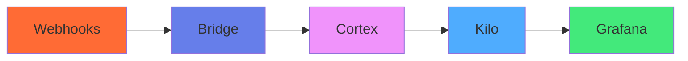

# Architecture Flow Animation

<div style="text-align: center; margin: 20px 0;">
  <iframe src="architecture_flow_animation.html" width="100%" height="400" frameborder="0" style="border-radius: 8px; box-shadow: 0 4px 12px rgba(0,0,0,0.3);"></iframe>
</div>

## Incident Response Flow

The Brain Swarm architecture processes incidents through a sequential flow of specialized components:

### 1. 🔗 Webhooks - Alert Ingestion
External monitoring systems and services send alerts via webhooks. This includes:
- ServiceNow incident notifications
- Prometheus Alertmanager alerts
- Custom monitoring tools
- Third-party service integrations

### 2. 🌉 Bridge - Data Transformation
The webhook bridge component normalizes incoming alert data:
- Standardizes alert formats
- Enriches alerts with additional context
- Validates alert authenticity
- Routes alerts to appropriate processing queues

### 3. 🧠 Cortex - Incident Processing
Cortex analyzes and correlates alerts:
- Determines alert severity and impact
- Correlates related incidents
- Applies intelligent triage rules
- Escalates critical incidents automatically

### 4. 🤖 Kilo - AI Orchestration
Kilo Code AI provides advanced analysis and response:
- Natural language processing of incident descriptions
- Predictive analysis of potential impacts
- Automated remediation suggestions
- Coordination of multi-system responses

### 5. 📊 Grafana - Visualization & Monitoring
Real-time dashboards provide visibility:
- Live incident status tracking
- System health monitoring
- AI-driven insights and recommendations
- Stakeholder communication interfaces

## Animation Controls

- **SPACEBAR**: Pause/Resume the animation
- The animation loops continuously, highlighting each component in sequence
- Hover effects and glow animations show data flow between components

## Technical Implementation

The animation demonstrates the real-time data flow through the Brain Swarm architecture:



## Integration Points

### MkDocs Embedding
This animation can be embedded in documentation using iframes:

```html
<iframe src="architecture_flow_animation.html" width="100%" height="400" frameborder="0"></iframe>
```

### Dashboard Integration
For Vercel or other dashboard platforms, the HTML can be embedded directly or converted to React components.

### Customization
The animation is fully customizable:
- Color schemes can be modified in the CSS
- Animation timing can be adjusted via JavaScript variables
- Component icons and labels can be changed
- Responsive design works on mobile and desktop

## Performance Characteristics

- **Animation Frame Rate**: 60 FPS smooth animations
- **File Size**: ~15KB (optimized SVG and CSS)
- **Browser Support**: Modern browsers with CSS animations
- **Accessibility**: Keyboard controls and screen reader friendly